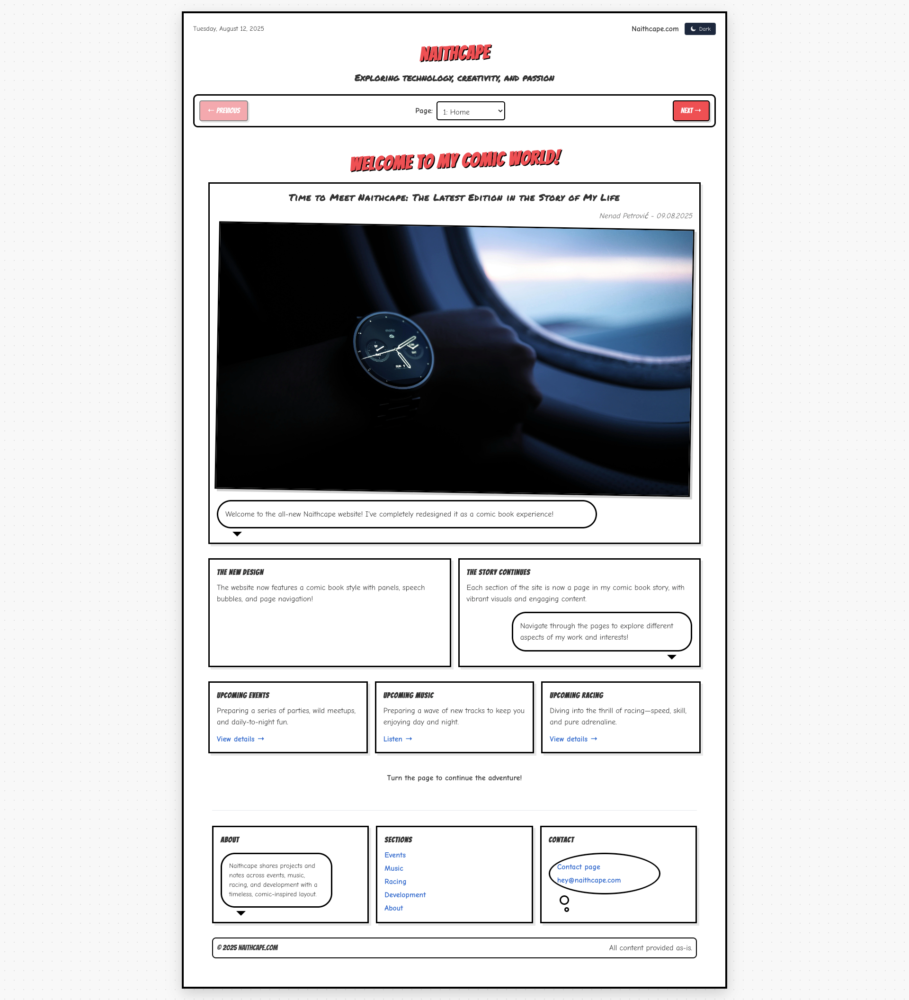
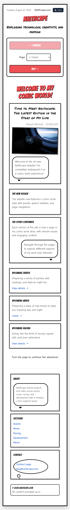
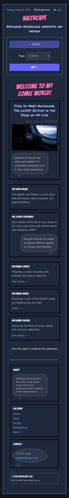
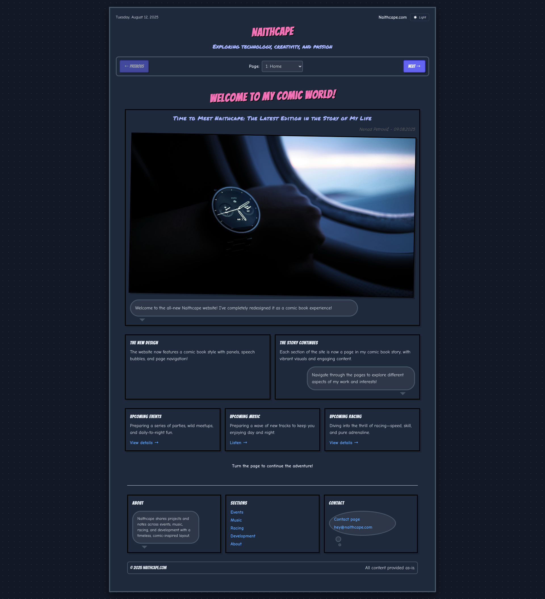

# Naithcape Comic Book Portfolio Website

A creative, comic book-styled portfolio website for Nenad Petrović (Naithcape), showcasing various aspects of work and interests through an engaging comic book experience.



## 📖 About

This project is a unique portfolio website designed in the style of a comic book. It features:

- Comic book-styled UI with panels, speech bubbles, and page transitions
- Different sections presented as "pages" in the comic book
- Responsive design that works across devices
- Interactive elements and engaging visuals

## 🚀 Features

- **Comic Book Experience**: Navigate through the website as if reading a comic book
- **Multiple Sections**: Explore different aspects including Events, Music, and Racing
- **Responsive Design**: Optimized for both desktop and mobile viewing
- **Modern UI**: Built with React and styled with Tailwind CSS

## 🖼️ Screenshots

### Desktop


### Mobile


### Mobile


### Desktop


## 🛠️ Technologies Used

- **React**: Frontend library for building the user interface
- **Vike**: Framework for server-side rendering and routing
- **Kiru**: Utility for enhanced React development
- **Tailwind CSS**: For styling the application
- **TypeScript**: For type-safe code
- **Vite**: Build tool for fast development and optimized production builds

## 🔧 Installation

1. Clone the repository:
   ```bash
   git clone https://github.com/yourusername/comicbook-portfolio-website.git
   cd comicbook-portfolio-website
   ```

2. Install dependencies:
   ```bash
   npm install
   ```

## 🚀 Usage

### Development

To run the project in development mode:

```bash
npm run dev
```

This will start the development server at `http://localhost:3000`.

### Building for Production

To build the project for production:

```bash
npm run build
```

### Preview Production Build

To preview the production build locally:

```bash
npm run preview
```

## 📝 Project Structure

- `/src`: Source code
  - `/components`: Reusable React components
  - `/pages`: Page components and layouts
  - `/renderer`: Server-side rendering configuration
- `/public`: Static assets
- `/screenshots`: Website screenshots

## 👤 Author

- **Nenad Petrović (Naithcape)**

## 📄 License

This project is licensed under the MIT License - see the LICENSE file for details.